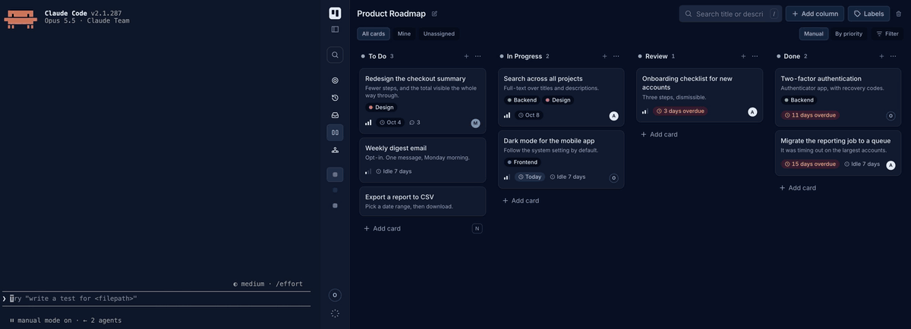

# noeto-mcp

An MCP server that lets an AI agent work a [noeto](https://noeto.online) kanban
board: read it, create and update cards, move them, comment, and keep a written
document on a card.



## Quick start (Claude Code)

1. In noeto, **Settings → Access tokens → Create token**, and copy the secret.
2. Install the plugin. It bundles the server and the `/card` workflow:

   ```sh
   /plugin marketplace add noeto-tasks/noeto-mcp
   /plugin install noeto@noeto-mcp
   ```

3. Export the token and restart Claude Code:

   ```sh
   export NOETO_TOKEN=noeto_pat_…
   export NOETO_API_URL=https://api.noeto.online/api/v1
   ```

Then ask: *"What's on my board?"* More in the [plugin README](plugins/noeto/README.md).

## Other ways to run it

**Docker**, for any MCP host:

```sh
claude mcp add noeto -s user \
  -e NOETO_TOKEN=noeto_pat_… \
  -e NOETO_API_URL=https://api.noeto.online/api/v1 \
  -- docker run -i --rm -e NOETO_TOKEN -e NOETO_API_URL ghcr.io/noeto-tasks/noeto-mcp:v0.6.5
```

Or by hand in `~/.claude.json`, `.mcp.json` or Claude Desktop's config:

```json
{
  "mcpServers": {
    "noeto": {
      "command": "docker",
      "args": ["run", "-i", "--rm", "-e", "NOETO_TOKEN", "-e", "NOETO_API_URL",
               "ghcr.io/noeto-tasks/noeto-mcp:v0.6.5"],
      "env": {
        "NOETO_TOKEN": "noeto_pat_…",
        "NOETO_API_URL": "https://api.noeto.online/api/v1"
      }
    }
  }
}
```

**Native binary**, with Homebrew:

```sh
brew install noeto-tasks/tap/noeto-mcp
claude mcp add noeto -s user \
  -e NOETO_TOKEN=noeto_pat_… \
  -e NOETO_API_URL=https://api.noeto.online/api/v1 \
  -- "$(brew --prefix)/bin/noeto-mcp"
```

Or take an archive from [releases](https://github.com/noeto-tasks/noeto-mcp/releases)
(macOS, Linux, Windows). The binary is unsigned, so on macOS run
`xattr -d com.apple.quarantine noeto-mcp` first. Point the config at it by
absolute path.

**Good to know**

- One server serves one team — the token decides which. For two teams, add two
  entries with their own tokens (`noeto-work`, `noeto-personal`).
- Against a local noeto from Docker, use `http://host.docker.internal:8081/api/v1`
  (macOS, Windows) or `--network host` (Linux).
- It runs as a local process, so it works in Claude Code and Claude Desktop, not
  in claude.ai in the browser or the mobile apps.

## Tools

| tool | what it does | |
|---|---|---|
| `list_boards` | the team's boards, with card counts | reads |
| `get_board` | one board: columns in order and the cards in them | reads |
| `find_cards` | search every board by text, assignee, label, priority, column, due date | reads |
| `get_card` | one card in full, with comments and the files on it | reads |
| `list_members` | who is on the team | reads |
| `whoami` | which member the token belongs to | reads |
| `create_card` | add a card to a column | writes |
| `update_card` | title, description, assignee, priority, due date, labels | writes |
| `move_card` | to another column, or reorder within one | writes |
| `comment_on_card` | post a comment | writes |
| `read_document` | the Markdown of a document on a card | reads |
| `attach_document` | write one, replacing the previous copy of that name | replaces |
| `read_attachment` | a text or image file on a card | reads |
| `download_attachment` | save any file on a card to disk and return its path | saves locally |

- Boards, columns, labels and people can be named: `move_card(card, column: "Done")`.
  The card itself needs its id, so a typo can never edit the wrong card.
- `none` clears a field: `update_card(card, due: "none")`. An omitted argument
  leaves it alone.
- Documents and text files are capped at 512 KB, images at 1.5 MB. Bigger files
  and other types go through `download_attachment`.
- Downloads land in `NOETO_DOWNLOAD_DIR` (default: `noeto-attachments` in the
  system temp directory). In Docker, mount that directory at the same path on
  both sides — the plugin's config already does.

It deliberately **cannot delete anything a person made**, and does not create
boards, columns or labels. The reasoning behind these and the other choices is in
[docs/internals.md](docs/internals.md).

## Development

```sh
make test         # hermetic, against a fake API
make smoke        # contract check against a running noeto (needs NOETO_TOKEN)
make lint
make docker       # build the image for this machine
make release-dry  # build release artifacts into dist/, publish nothing
```

Run `make smoke` after any API change.

**Releasing:** Actions → **Release** → Run workflow, with the version (`0.6.3`).
It tests, pins the version, pushes the image, tags, publishes the GitHub release
and Homebrew cask, and lists the version in the MCP Registry. It needs a
`HOMEBREW_TAP_TOKEN` secret that can write to `noeto-tasks/homebrew-tap`.
`make release-plugin RELEASE=x.y.z` does the same from a laptop, except the
registry: run the **Publish to MCP Registry** workflow afterwards.
